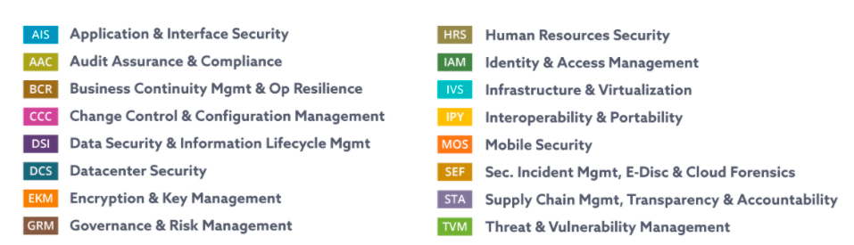

# Cloud Security Alliance 

cybersecurity control framework for cloud computing\
197 control objectives that are structured in 17 domains\
[CAIQ Questionnaire](https://cloudsecurityalliance.org/artifacts/consensus-assessments-initiative-questionnaire-v3-1/):
Consensus Assessment Initiative Questionnaire\
[STAR Security Trust Assurance and Risk Registry](https://cloudsecurityalliance.org/star/) 
